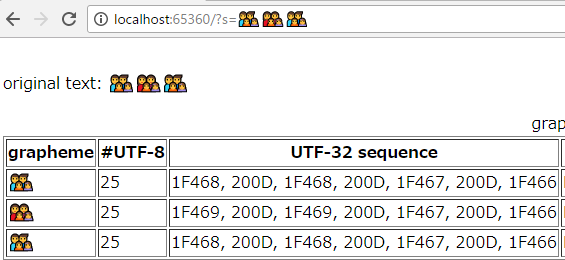

# GraphemeSplitter

A C# implementation of the Unicode grapheme cluster breaking algorithm.

## NuGet package

https://www.nuget.org/packages/GraphemeSplitter/

```powershell
Install-Package GraphemeSplitter
```

## Sample

```cs
using GraphemeSplitter;
using static System.Console;
using static System.String;

public partial class Program
{
    static string Split(string s) => Join(", ", s.GetGraphemes());

    static void Main()
    {
        WriteLine(Split("👨‍👨‍👧‍👦👩‍👩‍👧‍👦👨‍👨‍👧‍👦")); // 👨‍👨‍👧‍👦, 👩‍👩‍👧‍👦, 👨‍👨‍👧‍👦
    }
}
```

[Web Sample](tree/master/RazorPageSample):




## Implementation

This library basically implements http://unicode.org/reports/tr29/.

Expample:

type | text | split result
--- | --- | ---
diacritical marks | à̡̠́ḅ̢̂̃c̣̤̃̄d̥̦̅̆ | "à̡̠́", "ḅ̢̂̃", "c̣̤̃̄", "d̥̦̅̆"
variation selector | 葛葛󠄀葛󠄁 | "葛", "葛󠄀", "葛󠄁"
asian syllable | 안녕하세요 | "안", "녕", "하", "세", "요"
family emoji | 👨‍👨‍👧‍👦👩‍👩‍👧‍👦👨‍👨‍👧‍👦 | "👨‍👨‍👧‍👦", "👩‍👩‍👧‍👦", "👨‍👨‍👧‍👦"
emoji skin tone | 👩🏻👱🏼👧🏽👦🏾 | "👩🏻", "👱🏼", "👧🏽", "👦🏾"

but slacks out the GB10, GB12, and GB13 rules for simplification.

original:

- GB10 … (E_Base | EBG) Extend* × E_Modifier
- GB12 … sot (RI RI)* RI × RI
- GB13 … [^RI] (RI RI)* RI × RI

implemented:

- GB10 … (E_Base | EBG) × Extend
- GB10 … (E_Base | EBG | Extend) × E_Modifier
- GB12/GB13 … RI × RI

The difference is:

sequence       | original | implemented
--- | --- | ---
à🏻‍ (U+61, U+300, U+1F3FB)  | × ÷    | × ×
🇯🇵🇺🇸 (U+1F1EF, U+1F1F5, U+1F1FA, U+1F1F8) | × ÷ × | × × ×

(where ÷ and × means boundary and no bounadry respectively.)

## Acknowledgements

This library is indluenced by
- https://github.com/devongovett/grapheme-breaker
- https://github.com/orling/grapheme-splitter
- https://github.com/unicode-rs/unicode-segmentation
